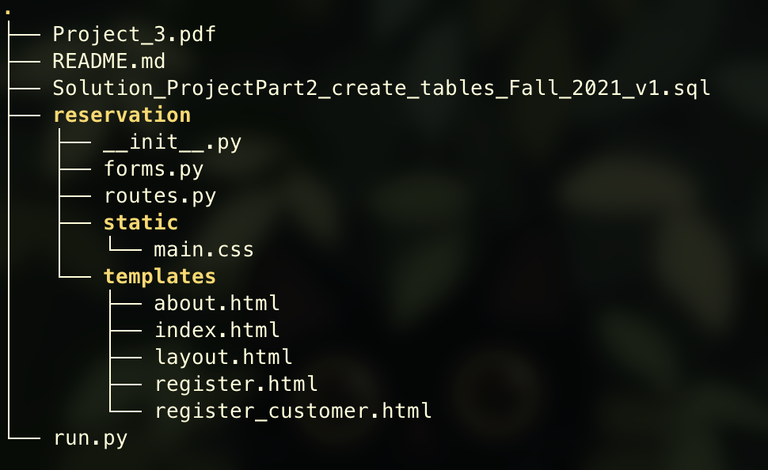

# CSCI-SHU-213-Database-Final-Project
> Ricercar & Jason

 To build an online Air Ticket Reservation System

## Getting Started
### Prerequisites
* flask
* flask-wtf
* flask-bcrypt

### Start the server
1. Create the database
2. Run the python file run.py

## Resources
### A Simple Flask Tutorial by Corey Schafer
* [Flask Tutorial](https://www.youtube.com/playlist?list=PL-osiE80TeTs4UjLw5MM6OjgkjFeUxCYH)
* [Flask Tutorial Source Code](https://github.com/CoreyMSchafer/code_snippets/tree/master/Python/Flask_Blog)

### Example Project
* https://github.com/Jaxingjili/NYU-Database-Project_2022

### Imported Package Documentations
* [Flask](https://flask.palletsprojects.com/en/2.0.x/)
* [wtforms](https://wtforms.readthedocs.io/en/3.0.x/)
* [bootstrap](https://getbootstrap.com/docs/5.3/getting-started/introduction/)

## Webui Design Inspirations
* https://wwws.airfrance.com.cn/
* https://www.cathaypacific.com/cx/en_HK.html
* https://www.skyscanner.com.hk/?&associateID=SEM_GGF_19370_00062

## File Structure
*Last Update: 2023.4.15*

